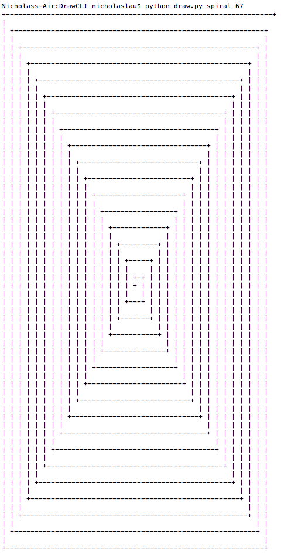

DRAW(1)

### Name

Draw

### Usage

draw.py [-h] [-f FORMAT] shape size

positional arguments:
* shape: choose what shape you want drawn
* size: choose the size of the shape

optional arguments:
* -h, --help: &nbsp; show this help message and exit
* -f FORMAT, --format FORMAT: &nbsp; choose the format

## Example

Example: python draw.py spiral 67 -f ascii

Output:

